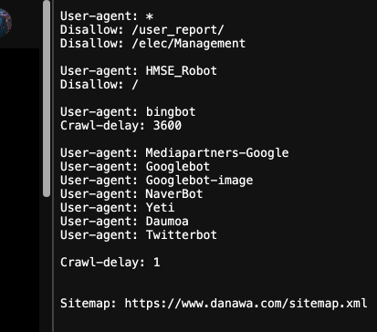
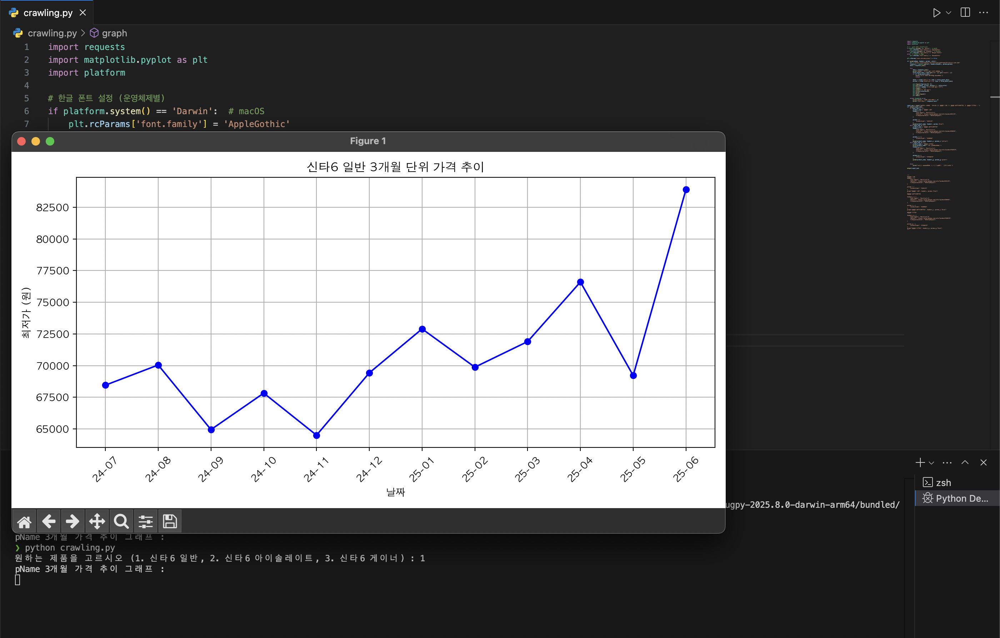

# Track3_bodySync
## 🛠️ 탄/단/지(Track3) 관리 시스템 소개
### 사용자에게 입력받은 키, 몸무게, 체중 등을 기반으로 적절한 탄/단/지와<br> 적자 칼로리를 계산해주고 특정 프로틴 보충제의 가격 추이를 보여준다.
## ✅ 주요 기능
- 키, 몸무게, 체중 (인바디 정보) 등을 날짜별로 저장
- 입력받은 데이터를 기반으로 적절한 탄/단/지 계산 및 적자 칼로리 계산
- 운동 수준(고수, 중수, 하수, 초보)를 고르면 그에 맞는 운동 루틴 추천
- 단백질 보충에 필요한 보충제의 가격 추이 그래프를 보여주고 타사 제품과 가격 비교
## ✅ 파일 구조
## ✅ 가격비교를 위해 다나와 상품 페이지 크롤링(Crawling)
- js 코드를 분석하여 어떤 형식으로 데이터를 받아오는지 확인
- 상품 페이지에서 f12를 눌러 개발자도구 > XHR 필터 사용
- 가격 추이 데이터를 가져오는 AJAX 요청 url 찾기
## 📌 크롤링 하기전 선행 작업
### 크롤링 할 페이지 url 뒤에 robots.txt 를 입력하면 어떤 경로로 크롤링 할 수 있는지 보여준다.

- 봇 밑에 Disallowed 라고 되어있으면 크롤링이 금지된 봇.
- Crawl-delay : 숫자 -> 크롤링 간격을 조정 해둔 것.
- ⭐️ 하지만 이번 크롤링 작업에서는 브라우저에서 AJAX를 요청하는 방식으로 크롤링하기 때문에 위 목록과는 무관하다.
## 📌 필요 라이브러리 호출
```
import requests
import matplotlib.pyplot as plt
import platform
```
## 📌 선택된 제품의 데이터를 받아와 그래프를 그리는 코드
```
def graph(pName, headers, params, color):
    url = "https://prod.danawa.com/info/ajax/getProductPriceList.ajax.php"
    response = requests.get(url, headers=headers, params=params)
    data = response.json()
 
    try:
        data = response.json()
        print("pName", "3개월 가격 추이 그래프 :")
        three_month_data = data.get("12", {}).get("result", [])
        if not three_month_data:
            print("3개월 단위 데이터가 없습니다.")
            return

        dates = [item['date'] for item in three_month_data]
        prices = [item['minPrice'] for item in three_month_data]

        plt.figure(figsize=(10, 5))
        plt.plot(dates, prices, marker='o', color=color)
        plt.title(f"{pName} 3개월 단위 가격 추이")
        plt.xlabel("날짜")
        plt.ylabel("최저가 (원)")
        plt.xticks(rotation=45)
        plt.grid()
        plt.tight_layout()
        plt.show()

    except Exception as e:
        print("pName", "JSON 파싱 실패:", e)
        print("응답 본문:", response.text)
```
## 📌 제품을 선택하면 해당 제품의 코드에 맞춰 크롤링을 해오는 코드
```
input_num = input("원하는 제품을 고르시오 (1. 신타6 일반, 2. 신타6 아이솔레이트, 3. 신타6 게이너) : ")
def output(input_num):
    if input_num == "1":
        product_name = "신타6 일반"
        headers = {
            "User-Agent": "Mozilla/5.0",
            "Referer": "https://prod.danawa.com/info/?pcode=5261178",
            "X-Requested-With": "XMLHttpRequest",
        }

        params = {
            "productCode": "5261178"
        }
        graph(product_name, headers, params,"blue")
    elif input_num == "2":
        product_name = "신타6 아이솔레이트"
        headers_i = {
            "User-Agent": "Mozilla/5.0",
            "Referer": "https://prod.danawa.com/info/?pcode=5260658",
            "X-Requested-With": "XMLHttpRequest",
        }

        params_i = {
            "productCode": "5260658"
        }
        graph(product_name, headers_i, params_i,"yellow")
    elif input_num == "3":
        product_name = "신타6 게이너"
        print(product_name + "을 택하셨습니다.")
        headers_g = {
            "User-Agent": "Mozilla/5.0",
            "Referer": "https://prod.danawa.com/info/?pcode=57846578",
            "X-Requested-With": "XMLHttpRequest",
        }

        params_g = {
            "productCode": "57846578"
        }
        graph(product_name, headers_g, params_g,"green")
        

    else:
        print("잘못된 입력입니다. 1, 2, 3 중에서 선택해주세요.")

output(input_num)
```
## ⭐️ 크롤링을 할 때 headers와 같은 딕셔너리를 넣지 않을 경우 bot으로 인식해 크롤링이 불가능해진다.
```
"User-Agent": "Mozilla/5.0",
```
- 위 코드를 이용해 브라우저에서 접속한 것처럼 설정해준다.
```
"Referer": "https://prod.danawa.com/info/?pcode=5261178",
```
- 위 코드로 내가 AJAX 요청을 보내게 된 상품 페이지의 주소를 알린다.
```
X-Requested-With": "XMLHttpRequest",
```
- 위 코드로 이 요청이 js에서 실행된 AJAX 요청임을 알린다.
## 🔍 해당 코드의 결과
### ✅ 순수 가격 추이 데이터 결과
```
{'1': {'count': 4, 'result': [{'Fulldate': '25-05-13', 'date': '05-13', 'minPrice': 69220}, {'Fulldate': '25-05-20', 'date': '05-20', 'minPrice': 69220}, {'Fulldate': '25-05-27', 'date': '05-27', 'minPrice': 80000}, {'Fulldate': '25-06-03', 'date': '06-03', 'minPrice': 83900}], 'maxPrice': '83900', 'minPrice': '69220'}, '3': {'count': 12, 'result': [{'Fulldate': '25-03-18', 'date': '03-18', 'minPrice': 76600}, {'Fulldate': '25-03-25', 'date': '03-25', 'minPrice': 76600}, {'Fulldate': '25-04-01', 'date': '04-01', 'minPrice': 76600}, {'Fulldate': '25-04-08', 'date': '04-08', 'minPrice': 76600}, {'Fulldate': '25-04-15', 'date': '04-15', 'minPrice': 76600}, {'Fulldate': '25-04-22', 'date': '04-22', 'minPrice': 76600}, {'Fulldate': '25-04-29', 'date': '04-29', 'minPrice': 76600}, {'Fulldate': '25-05-06', 'date': '05-06', 'minPrice': 76600}, {'Fulldate': '25-05-13', 'date': '05-13', 'minPrice': 69220}, {'Fulldate': '25-05-20', 'date': '05-20', 'minPrice': 69220}, {'Fulldate': '25-05-27', 'date': '05-27', 'minPrice': 80000}, {'Fulldate': '25-06-03', 'date': '06-03', 'minPrice': 83900}], 'maxPrice': '83900', 'minPrice': '69220'}, '6': {'count': 7, 'result': [{'date': '24-12', 'minPrice': 69430}, {'date': '25-01', 'minPrice': 72900}, {'date': '25-02', 'minPrice': 69880}, {'date': '25-03', 'minPrice': 71900}, {'date': '25-04', 'minPrice': 76600}, {'date': '25-05', 'minPrice': 69220}, {'date': '25-06', 'minPrice': 83900}], 'maxPrice': 83900, 'minPrice': 69220}, '12': {'count': 12, 'result': [{'date': '24-07', 'minPrice': 68460}, {'date': '24-08', 'minPrice': 70050}, {'date': '24-09', 'minPrice': 64950}, {'date': '24-10', 'minPrice': 67830}, {'date': '24-11', 'minPrice': 64510}, {'date': '24-12', 'minPrice': 69430}, {'date': '25-01', 'minPrice': 72900}, {'date': '25-02', 'minPrice': 69880}, {'date': '25-03', 'minPrice': 71900}, {'date': '25-04', 'minPrice': 76600}, {'date': '25-05', 'minPrice': 69220}, {'date': '25-06', 'minPrice': 83900}], 'maxPrice': 83900, 'minPrice': 64510}, '24': {'count': 23, 'result': [{'date': '23-08', 'minPrice': 65470}, {'date': '23-09', 'minPrice': 65370}, {'date': '23-10', 'minPrice': 65660}, {'date': '23-11', 'minPrice': 67680}, {'date': '23-12', 'minPrice': 67910}, {'date': '24-01', 'minPrice': 65640}, {'date': '24-02', 'minPrice': 65580}, {'date': '24-03', 'minPrice': 64160}, {'date': '24-04', 'minPrice': 63200}, {'date': '24-05', 'minPrice': 67580}, {'date': '24-06', 'minPrice': 65430}, {'date': '24-07', 'minPrice': 68460}, {'date': '24-08', 'minPrice': 70050}, {'date': '24-09', 'minPrice': 64950}, {'date': '24-10', 'minPrice': 67830}, {'date': '24-11', 'minPrice': 64510}, {'date': '24-12', 'minPrice': 69430}, {'date': '25-01', 'minPrice': 72900}, {'date': '25-02', 'minPrice': 69880}, {'date': '25-03', 'minPrice': 71900}, {'date': '25-04', 'minPrice': 76600}, {'date': '25-05', 'minPrice': 69220}, {'date': '25-06', 'minPrice': 83900}], 'maxPrice': 83900, 'minPrice': 63200}}
```
#### 🔍 데이터 구조
```
{
  "1": {...},    // 최근 1주일
  "3": {...},    // 최근 3주
  "6": {...},    // 최근 6개월
  "12": {...},   // 최근 12개월
  "24": {...}    // 최근 24개월
}
```
### 🛠️ 데이터를 그래프로 변환해 한눈에 식별하기 편하게 바꿈
```
    plt.figure(figsize=(10, 5))
        plt.plot(dates, prices, marker='o', color=color)
        plt.title(f"{pName} 3개월 단위 가격 추이")
        plt.xlabel("날짜")
        plt.ylabel("최저가 (원)")
        plt.xticks(rotation=45)
        plt.grid()
        plt.tight_layout()
        plt.show()
```

